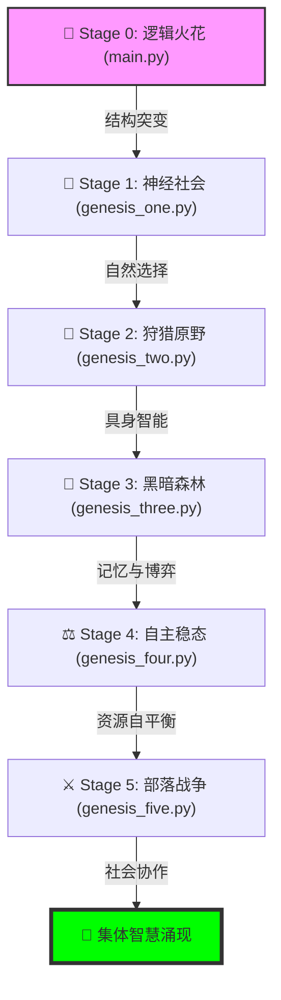
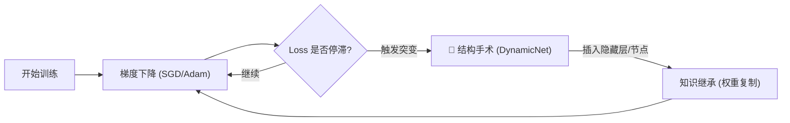

# 🌌 Genesis: 人工生命与神经进化模拟 🧬

[](https://www.python.org/downloads/)
[](https://pytorch.org/)
[](https://www.pygame.org/)
[](https://opensource.org/licenses/MIT)

> **"智慧并非设计的结果，而是生存压力下的涌现。"** 🌱

Genesis 是一个迷人且强大的实验性项目，旨在探索机器智能的起源！✨ 它不仅是在编写智能程序，而是在编写“进化法则”本身。通过 6 个递进的进化阶段，你可以见证可爱的小智能体（Agents）从基础逻辑单元进化为具有空间感知、记忆、博弈策略和部落协作能力的先进群体。🥰

---

## 🎨 架构可视化 (Architecture)

### 1. 进化阶段层级图
项目通过六个核心阶段，模拟了生命从解决抽象逻辑到建立社会契约的全过程。



### 2. 神经架构突变循环 (DynamicNet)
Stage 0 & 1 的核心技术，模拟“大脑手术”以突破学习瓶颈。



---

## 📂 演化阶段深度解析 🚀

### 🌟 阶段 0: 逻辑火花 (`main.py`)
*   **设计哲学**: **自我修改架构 (Self-Modifying Architecture)** 🛠️
*   **核心机制**: 当极简网络遇到无法解决的 XOR 问题时，它会对自己执行“脑部手术”，自动添加隐藏层或神经元，并保留已习得的知识。

### 🦋 阶段 1: 神经社会 (`genesis_one.py`)
*   **设计哲学**: **物竞天择 (Natural Selection)** 🧬
*   **核心机制**: 引入种群概念。只有成功解决 XOR 问题的个体才能获得能量并繁衍，将优秀的神经网络结构遗传给下一代。

### 🍖 阶段 2: 狩猎原野 (`genesis_two.py`)
*   **设计哲学**: **具身智能 (Embodied Intelligence)** 🏃‍♂️
*   **核心机制**: 智能体进入 2D 可视化世界。它们必须学会移动和寻找食物来生存。生存压力从抽象逻辑转向受限环境下的空间搜索。

### 🌲 阶段 3: 黑暗森林 (`genesis_three.py`)
*   **设计哲学**: **时序记忆 (RNN/GRU)** 🔄
*   **核心机制**: 引入循环神经网络。智能体获得了“记忆”，可以处理时序信息，从而在残酷的生存博弈中决定是追击弱者还是躲避强者。

### ⚖️ 阶段 4: 自主稳态 (`genesis_four.py`)
*   **设计哲学**: **脑塑性与体内平衡 (Homeostasis)** 🧘‍♀️
*   **核心机制**: 智能体可以自主决定进化路径（看得更远或记下更多）。环境自动平衡器会根据种群密度调整食物产量，维持生态平衡。

### ⚔️ 阶段 5: 部落战争 (`genesis_five.py`)
*   **设计哲学**: **社会化行为 (Social Behavior)** 🤝
*   **核心机制**: 智能体分为红蓝两大部落。它们需要通过“肤色”识别队友，并学习协作捕猎巨大的猛犸象（🦣）以获取海量生存能量。

---

## 🛠️ 快速上手指南 💻

### 1. 环境准备 📦
确保安装了 Python 3.8+，然后一键安装核心依赖：

```bash
pip install torch numpy matplotlib pygame
```

### 2. 运行模拟 🏃‍♀️
建议按进化顺序运行，见证奇迹：

```bash
# 阶段 0: 观察单个网络通过进化解决逻辑难题 🧠
python main.py

# 阶段 1: 观察种群中的自然选择过程 🦋
python genesis_one.py

# 阶段 2: 开启 2D 狩猎场，观察觅食行为 🍖
python genesis_two.py

# 阶段 3: 进入黑暗森林，见证记忆与博弈 🌲
python genesis_three.py

# 阶段 4: 激活自主进化与环境平衡模式 ⚖️
python genesis_four.py

# 阶段 5: 目睹部落冲突与协作捕猎 ⚔️🦣
python genesis_five.py
```

### 🎮 Pygame UI 使用说明
在阶段 2-5 的图形界面中：
*   **红/蓝方块**: 我们的智能体！颜色深度代表能量或代际。
*   **绿色方块**: 美味的食物 (🍏)。
*   **紫色方块**: 巨型猛犸象 (Stage 5 专供 🦣)。
*   **UI 信息**: 左上角实时显示种群数量 (Pop)、最大代际 (Gen) 和环境统计。

---

> [!TIP]
> **观察建议**：在运行 Stage 5 时，观察同色智能体如何聚拢攻击猛犸象，这是集体智慧涌现的最佳证明。

> [!IMPORTANT]
> **性能注意**：由于模拟涉及大量独立神经网络的并行训练，建议在具有良好 CPU 性能的机器上运行。

---

> Created by **Antigravity** 🛸 | *Empowering Evolution with AI*
